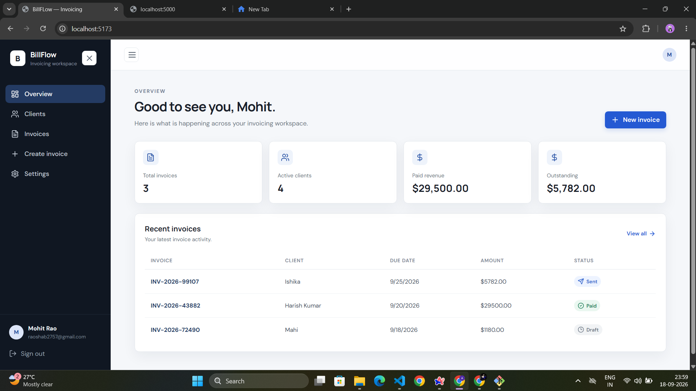
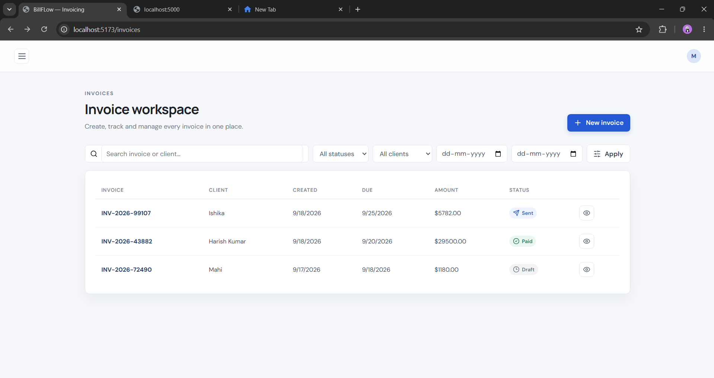
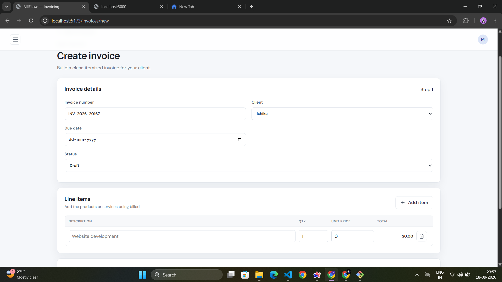
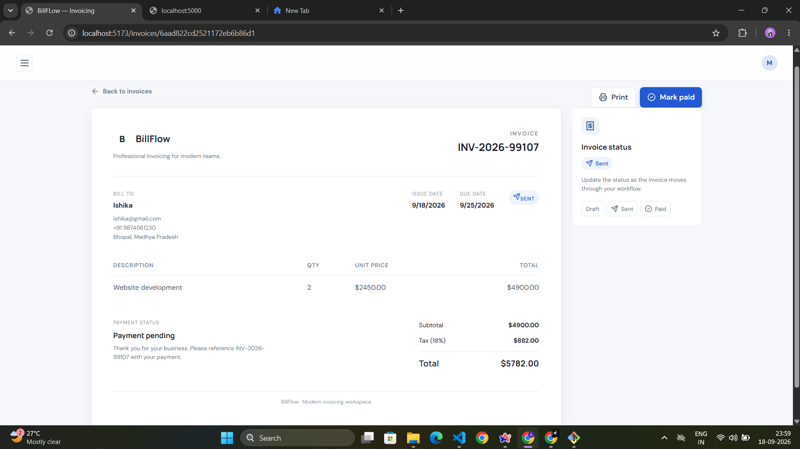
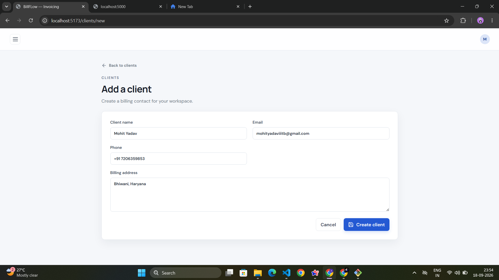

# BillFlow

**A full-stack invoicing platform for freelancers and small teams — manage clients, create itemized invoices, track payment status, and stay on top of your billing workflow from one clean dashboard.**

[](https://react.dev/)

[](https://vitejs.dev/)

[](https://nodejs.org/)

[](https://www.mongodb.com/)

[](https://jwt.io/)

[](./LICENSE)

**🔗 Live App:** [bill-flow-ashen.vercel.app](https://bill-flow-ashen.vercel.app) &nbsp;·&nbsp; **⚙️ API:** [billflow-project.onrender.com](https://billflow-project.onrender.com/api)

---

## Table of Contents

- [Overview](#overview)
- [Screenshots](#screenshots)
- [Key Features](#key-features)
- [Tech Stack](#tech-stack)
- [Project Structure](#project-structure)
- [Getting Started](#getting-started)
- [Environment Variables](#environment-variables)
- [API Reference](#api-reference)
- [Roadmap](#roadmap)
- [Author](#author)
- [License](#license)

---

## Overview

BillFlow is a MERN-stack invoicing application that lets a business owner manage their client relationships and billing in one place — from onboarding a new client, to drafting a fully itemized invoice with automatic tax calculation, to tracking whether that invoice has been paid, sent, or has gone overdue.

The project is built as a complete, production-style application: a REST API with authenticated, per-user data access on the backend, and a fast, responsive single-page app on the frontend — deployed and publicly accessible.

---

## Screenshots

<!--
  Add your screenshots below by replacing the placeholder text with:
  
-->

**Dashboard**



**Invoice Workspace**



**Create Invoice**



**Invoice Detail View**



**Client Management**



---

## Key Features

### 🔐 Authentication & Security
- Secure registration and login with `bcrypt`-hashed passwords
- JWT-based authentication with automatic access-token refresh
- Protected routes on both frontend and backend
- Strict per-user data isolation — every record is scoped to its owner

### 📊 Dashboard
- Real-time overview of total invoices, active clients, paid revenue, and outstanding amounts
- Recent invoice activity at a glance, with quick navigation to details

### 👥 Client Management
- Full CRUD for clients — name, email, phone, and billing address
- Instant search across name, email, phone, or billing address
- Cascading delete — removing a client also removes their invoices

### 🧾 Invoicing
- Dynamic, itemized line items — add or remove rows on the fly
- Automatic subtotal, tax, and total calculation, verified server-side
- Powerful filtering — by status, client, or due-date range — combined with free-text search
- Full status lifecycle: **Draft → Sent → Paid**, with **Overdue** detected automatically from the due date
- Clean, print-ready invoice detail page
- One-click status updates

### 🎨 User Experience
- Fully responsive UI with a collapsible sidebar and mobile navigation
- Consistent, icon-based status indicators throughout the app
- Thoughtful empty and loading states

---

## Tech Stack


| Layer | Technologies |
| :--- | :--- |
| **Frontend** | React 18, Vite, React Router, React Hook Form, Lucide Icons |
| **Backend** | Node.js, Express.js |
| **Database** | MongoDB, Mongoose |
| **Authentication** | JSON Web Tokens (JWT), bcrypt.js |
| **Deployment** | Vercel (frontend), Render (backend), MongoDB Atlas (database) |
| **Styling** | Tailwind CSS *(Example alternative)* |

---

## Project Structure

```
BillFlow/
├── backend/
│   ├── controllers/          # Business logic for auth, clients, invoices
│   ├── middleware/           # JWT auth guard & centralized error handler
│   ├── models/                # Mongoose schemas — User, Client, Invoice
│   ├── routes/                # Express route definitions
│   ├── utils/                  # Shared validation helpers
│   ├── server.js              # App entry point
│   └── package.json
│
├── frontend/
│   ├── src/
│   │   ├── components/        # Layout, ProtectedRoute, StatusBadge, Icons
│   │   ├── pages/              # Route-level views (Dashboard, Clients, Invoices, Auth...)
│   │   ├── api.js              # Fetch wrapper + session/token handling
│   │   ├── App.jsx             # Route tree
│   │   └── main.jsx            # App entry point
│   ├── index.html
│   └── package.json
│
├── docs/
│   └── screenshots/
├── LICENSE
└── README.md
```

---

## Getting Started

### Prerequisites

- [Node.js](https://nodejs.org/) v18 or higher
- A [MongoDB](https://www.mongodb.com/atlas) database (local instance or Atlas)

### 1. Clone the repository

```bash
git clone https://github.com/ydvmohittt-dev/BillFlow.git
cd BillFlow
```

### 2. Set up the backend

```bash
cd backend
npm install
```

Create a `.env` file (see [Environment Variables](#environment-variables)), then run:

```bash
npm run dev
```

The API will be available at `http://localhost:5000`.

### 3. Set up the frontend

```bash
cd frontend
npm install
```

Create a `.env` file (see [Environment Variables](#environment-variables)), then run:

```bash
npm run dev
```

The app will be available at `http://localhost:5173`.

---

## Environment Variables

**`backend/.env`**

```env
PORT=5000
MONGODB_URI=your_mongodb_connection_string
JWT_SECRET=your_jwt_secret
NODE_ENV=development
```

**`frontend/.env`**

```env
VITE_API_URL=http://localhost:5000/api
```

---

## API Reference

Base URL: `/api` · Routes marked 🔒 require an `Authorization: Bearer <token>` header.

**Authentication**

| Method | Endpoint | Description |
|---|---|---|
| `POST` | `/auth/register` | Register a new account |
| `POST` | `/auth/login` | Log in and receive an access token |
| `GET` | `/auth/refresh-token` | Refresh an expired access token |
| `GET` | `/auth/me` 🔒 | Get the currently authenticated user |
| `POST` | `/auth/logout` | Log out and clear the session |

**Clients** 🔒

| Method | Endpoint | Description |
|---|---|---|
| `GET` | `/clients` | List all clients |
| `POST` | `/clients` | Create a new client |
| `PUT` | `/clients/:id` | Update an existing client |
| `DELETE` | `/clients/:id` | Delete a client |

**Invoices** 🔒

| Method | Endpoint | Description |
|---|---|---|
| `GET` | `/invoices` | List invoices — supports `status`, `clientId`, `from`, `to` filters |
| `POST` | `/invoices` | Create a new invoice |
| `GET` | `/invoices/:id` | Get full details of a single invoice |
| `PATCH` | `/invoices/:id/status` | Update an invoice's status |

---

## Roadmap


- [ ] Email invoices directly to clients
- [ ] Recurring and scheduled invoices
- [ ] Multi-currency support
- [ ] Premium and  Free user role
- [ ] Analytics and revenue charts

---

## Author

**Mohit Yadav**
[GitHub](https://github.com/ydvmohittt-dev)

---

## License

This project is licensed under the [MIT License](./LICENSE).